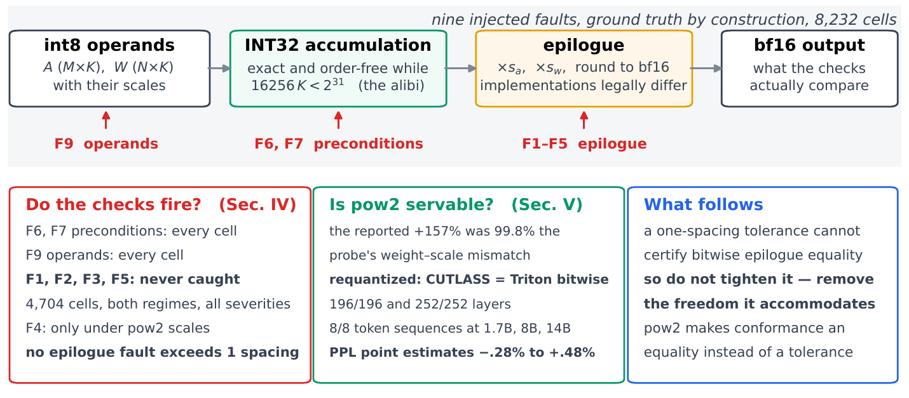
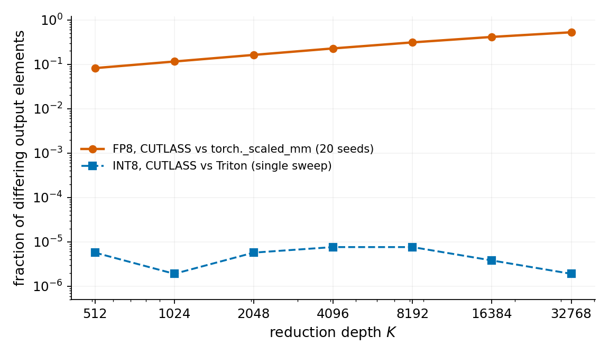
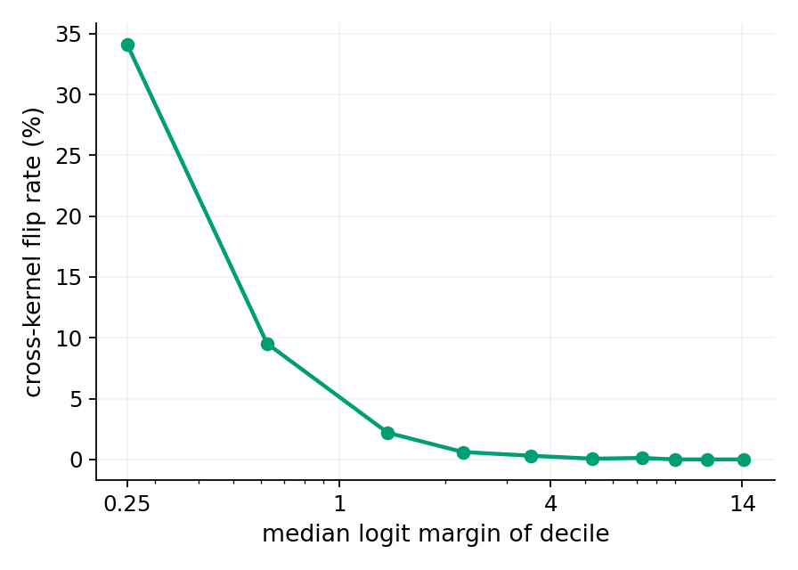
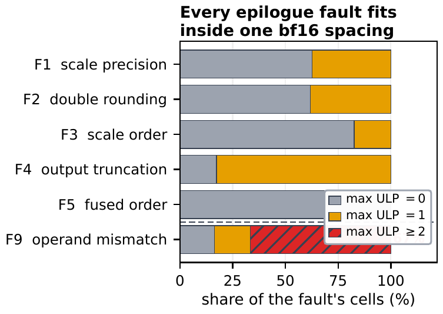
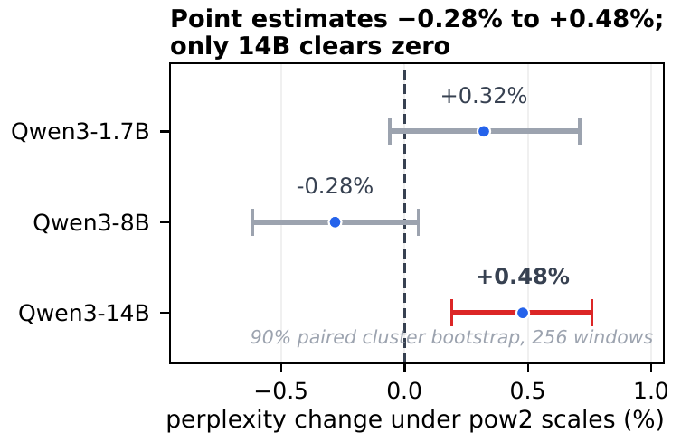
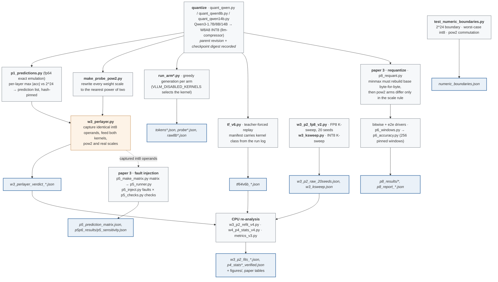

# INT8 Kernel Numerics: Measurement Programme and Reproducibility Companion


[](https://arxiv.org/abs/2608.13756)
[](https://arxiv.org/abs/2609.00363)

## Three papers, one question, and why two of them share this repository

The question underneath all three is the same: **when a serving stack picks one INT8 kernel
over another, what exactly does that choice decide?** Each paper answers a different half of
it, and they were written in this order.

| | paper | what it establishes | artifacts |
|---|---|---|---|
| 1 | **Spec Sheets Are Not Kernels** — [arXiv:2608.11693](https://arxiv.org/abs/2608.11693) | *Which* kernel serves a quantized format is a property of the whole stack, not of the model or the datasheet. An ISA- and source-level audit of INT8 availability on NVIDIA Blackwell Ultra. | a separate repository — different method (documentary audit), different apparatus (no GPU measurement) |
| 2 | **The Integer Alibi** — [arXiv:2608.13756](https://arxiv.org/abs/2608.13756) | What that choice changes *numerically*. Two kernels behind one interface agree on no generated sequence while each is bit-reproducible against itself; because INT32 accumulation is exact and order-free under a verified bound, the difference is localized to the epilogue. Ends by proposing a seven-check conformance procedure. | **this repository** |
| 3 | **Deterministic LLM Inference Across GPU Kernels** — [arXiv:2609.00363](https://arxiv.org/abs/2609.00363) | Whether that procedure works, and whether its one strict check is deployable. Fault injection shows the one-spacing tolerance check is blind to the tested epilogue faults — four families are caught by nothing, and truncation only by the power-of-two equality check; power-of-two requantization makes the two kernels agree byte for byte at all three sizes, at perplexity point estimates from −0.28% to +0.48% (90% intervals in the paper). | **this repository** |

<p align="center"></p>

*Paper 3 at a glance: one pipeline, nine injected fault families with ground truth known by
construction. The precondition and operand checks catch everything they should; four of the
five epilogue faults are caught by nothing, and truncation only under power-of-two scales —
which, requantized properly, also turn out to be a deployable serving configuration.*

**Why 2 and 3 share one repository, and 1 does not.** Papers 2 and 3 are one measurement
programme under one pre-registration. The amendment log is a single append-only document
(A-1 through A-12): paper 3's experiments were added as amendments A-10 to A-12 to the
protocol paper 2 locked, and two of them exist specifically to close gaps paper 2 disclosed in
its own limitations. They share the pinned container digest, the pinned checkpoint digests, the
captured operands, and the harness — paper 3's fault injector replays the very int8 activations
paper 2's localization was computed on. Splitting them would duplicate the apparatus and, worse,
break the amendment chain into two documents neither of which is append-only. Paper 1 shares
the motivation and nothing else: no GPU measurement, no checkpoints, no pre-registration of
this kind, so it has its own repository.

**Reading order if you only want one thing.** To check a number in paper 2 or 3, go to
[Repository layout](#repository-layout) and then the artifact named in the paper. To check the
protocol, start at `experiment/PREREGISTRATION_SUMMARY_EN.md`, which summarizes in English the
amendments the papers rely on, and cites `experiment/preregistration.md` as authoritative.

> **Scope of this companion.** The pre-registration, the per-layer prediction lists, every
> measurement artifact with its digest, and the analysis code are here. **The re-analysis is
> CPU-only and needs no API key**; the measurements themselves ran once on one RTX 4090 — see
> [Measurement environment](#measurement-environment).

> **The question.** A serving engine usually carries several implementations of
> the same quantized linear layer, and picks one at load time by hardware checks
> and environment variables. The implicit contract is that they are
> interchangeable: same operands in, same answer out. Swap only vLLM’s CUTLASS
> INT8 kernel for its Triton counterpart, hold everything else fixed, and every
> greedy continuation changes — while each arm reproduces itself bit-for-bit.
> They are not one function with noise; they are two deterministic functions.

<p align="center"></p>

*Fraction of differing output elements against reduction depth `K`, at `M = 256`,
`N = 2048`. FP8 (CUTLASS vs `torch._scaled_mm`, 20 seeds, nested-prefix inputs)
rises from 8% to 53%; INT8 (CUTLASS vs Triton, one unreplicated sweep) stays
between 1.9 and 7.6 parts per million. The two series are **not** matched
designs and the INT8 series has one draw per point — see
[the honest part](#result-3--what-the-checks-do-not-establish).*

---

## TL;DR

An exact integer accumulator can be used as a **control**. For shared INT8
operands under a verified no-overflow bound, the INT32 dot product is exact and
independent of reduction order, so the accumulator cannot be the source of any
cross-kernel difference — the *integer alibi*. That turns “two kernels disagree”
into a localization with a built-in negative control, and it suggests an
intervention: make the epilogue’s two scale multiplications exact by rounding
weight scales to powers of two, and the difference should vanish. It does.

| Comparison | Qwen3-1.7B | Qwen3-8B | Qwen3-14B |
|---|---:|---:|---:|
| quantized int8 linear layers | 196 | 252 | 280 |
| per-layer bit-identical, requantized pow2 scales | **196 / 196** | **252 / 252** | —¹ |
| per-layer bit-identical, checkpoints' real scales | 8 / 196 | 10 / 252 | —¹ |
| largest cross-arm bf16 ULP distance, real scales | **1** | **1** | —¹ |
| greedy sequences identical, real scales | 0 / 8 (0 / 64 long run) | 0 / 8² | 0 / 8 |
| greedy sequences identical, requantized pow2 | **8 / 8** | **8 / 8**² | **8 / 8** |
| perplexity cost of pow2 (90% CI covers zero?) | +0.32% (yes) | −0.28% (yes) | +0.48% (**no**) |

¹ 14B per-layer capture dequantizes to bfloat16 in-framework and exceeds the 24 GB card, so
14B evidence is end-to-end only (disclosed in paper 3).
² Paper 2 additionally ran 8B end-to-end at 16 prompts with its scale-*rewriting* probe:
0/16 real, 16/16 probe. That probe carried +157% perplexity — paper 3 shows 99.8% of it was
the probe's weight–scale mismatch, and replaces it with requantization at the cost above.

Teacher-forced replay on 16,384 positions: 769 single-step flips (4.7%), and the
logit margin ranks flip risk at **ROC-AUC 0.942** (prompt-cluster CI90
`[0.935, 0.949]`).

---

## Result 1 — The accumulator is above suspicion, and it holds on real silicon

Before any kernel comparison, an exact fp64 emulation of the integer pipeline
recorded each layer’s maximum accumulator magnitude and marked every layer whose
value stays below the `2^24` float32 representability threshold. All 448 layers
of the two models with per-layer captures (1.7B and 8B) clear it, with at least
2.82 bits of headroom; 14B has no per-layer capture (footnote 1 above). Under power-of-two
scales, where the commutation argument makes bitwise identity mandatory for
finite normal outputs, **all 448 layers are bit-identical** across CUTLASS and
Triton. No violation appeared, so the alibi caught no epilogue defect in this
kernel pair.

## Result 2 — Real scales diverge, but only at the last rounding

With the checkpoints’ own scales, 188 of 196 layers (1.7B) contain at least one
differing output. Every differing finite element is at most **one bf16 spacing**
apart, and no element anywhere in either model exceeds one ULP. Rewriting all
573,440 weight scales to the nearest power of two — leaving weights, activation
quantization, prompts and both kernel arms untouched — restores **bitwise
end-to-end agreement**: 8/8 sequences at 1.7B, 16/16 at 8B. Removing the
suspected freedom removes the divergence. Paper 3 closes the loop: that rewrite
degraded perplexity by +157%, but 99.8% of it was the rewrite's own weight–scale
mismatch — *requantizing* under power-of-two scales keeps the bitwise agreement
at three model sizes for −0.28% to +0.48% (`p8_results/`).

<p align="center"></p>

*Flip rate falls monotonically from 34% in the lowest-margin decile to zero above
a margin of about 9. A one-ULP layer difference matters only where it reaches a
decision boundary.*

## Result 3 — What the checks do **not** establish

The parts a reader should not over-read, all of them stated in the paper’s
limitations:

- **No positive control.** Every check reported here passed. None has been run
  against a deliberately faulty kernel, so their sensitivity and false-negative
  rates are unmeasured. *This was paper 2's disclosure; paper 3 then measured it*
  (`p5_sensitivity.json`): every epilogue fault stays within one bfloat16 spacing,
  so the one-spacing tolerance check is blind to all of them by construction,
  while the operand fault reaches distances up to 35,571 spacings.
- **The INT8 sweep is weak evidence on its own.** 18 differing elements in
  total across the whole `K` range, one unreplicated pass, operands and scales
  redrawn at each `K`. A constant-rate model fits ($\chi^2 = 3.8$, 6 d.f.), but
  a factor-of-two trend cannot be excluded. The per-layer results carry the
  load, not this curve.
- **One regime.** All per-layer captures use a single prefill-like tile
  (`M = 512`). The decode regime is untested at layer level.
- **The probe is a diagnostic, not a mitigation.** Power-of-two scales were
  never evaluated for accuracy, calibration or throughput. *Also since measured by
  paper 3* (`p8_results/`): requantized (not rewritten) power-of-two checkpoints give
  byte-identical generation at 1.7B, 8B and 14B, at perplexity point estimates from
  −0.28% to +0.48%; the reported +157% was the probe's weight–scale mismatch, 99.8%
  of it.
- **2.9% stays unresolved.** Under the probe, the same arm still disagrees with
  itself across prefill-replay versus decode on 2.9% of rail tokens. That
  originates outside the controlled INT8 epilogue; the first-divergence
  instrumentation fails in its engine glue, so no module is named.
- **Scope.** One consumer GPU (`sm_89`), one model family at two sizes, one
  engine version, two INT8 implementations plus one FP8 pair and one
  cross-engine comparison.

<p align="center"></p>

*Paper 3's sensitivity measurement: each epilogue fault's maximum ULP distance is exactly 0
or 1 across all 5,880 cells — inside the interval legal implementations occupy — while the
operand-mismatch fault reaches 68 to 35,571. A tolerance partitions the fault space at the
wrong boundary.*

<p align="center"></p>

*And its deployment price: observed point estimates from −0.28% to +0.48%, with the 90%
interval covering zero at 1.7B and 8B and excluding it at 14B.*

## Why it works

A W8A8 layer computes `Y = (A Wᵀ) · s_a s_w`: int8 products accumulate in INT32,
then two float32 scales apply, then the result rounds to bfloat16. Three
elementary facts partition that pipeline into stages that can and cannot legally
differ between implementations.

1. **Exact accumulation.** With symmetric int8 quantization each product lies in
   `[-16129, 16129]`; allowing an activation at `-128` widens it to `16256`, and
   the unrestricted extreme is `(-128)² = 16384`. Taking the conservative bound,
   `16256K < 2^31` for all `K ≤ 132,104`. Integer addition is associative, so
   any tiling, any split-`K`, any reduction tree produces the identical INT32
   value.
2. **Representability.** Every integer accumulator is exactly representable in
   float32 when `|acc| ≤ 2^24`. Above that the universal guarantee is lost
   (though individual values may still be exact: `2^24+1` rounds, `2^24+2` does
   not). Checking this in advance yields per-layer, falsifiable predictions.
3. **Power-of-two commutation.** Multiplying a float32 value by `2^k` shifts the
   exponent and leaves the mantissa alone, so it commutes with rounding for
   finite normal values. With power-of-two weight scales the two epilogue
   orderings agree bitwise, and the final cast rounds the same value once in
   either arm. The argument fails in the subnormal range, which the boundary
   tests exhibit rather than hide.

Under (1) and (2) the accumulator is exonerated. Real-scale differences can then
arise only in the scale multiplications and the output cast, which bounds them
near one bfloat16 spacing; by (3) a power-of-two probe removes even that freedom.
A floating-point GEMM has no analogous structure: FP8 products are exact in
float32, but their summation rounds per step and is order-dependent, so two
implementations may legitimately differ in ways that grow with depth.

## How the pipeline works

Measurement ran on one GPU under pinned container digests. **Everything
downstream of the raw artifacts is CPU-only**, so any result in the paper can be
recomputed without a GPU.



### Where to look instead of a stage table

Every stage has exactly one shell driver under `experiment/harness/drivers/` and its trace
under `experiment/artifacts/run_logs/`; each script's role, inputs and outputs are in its own
docstring. Two files carry the semantics everything else leans on: `metrics_v3.py` (bitwise
divergence vs finite-only ULP distance, and the identity/treatment contract) and
`p5_checks.py` (the seven conformance checks as executable predicates, applicability reported
separately from verdict). Figures regenerate from artifacts via `make_readme_figures.py`
(papers 1–2) and `build_figures_conformance.py` (paper 3).

## Repository layout
```
experiment/PREREGISTRATION_SUMMARY_EN.md  # English summary of the amendments the papers cite — start here
experiment/preregistration.md          # authoritative protocol, locked before backend comparison;
                                       #   amendments A-1..A-9 (paper 2), A-10..A-12 (paper 3), append-only
experiment/harness/                    # measurement scripts (GPU) and analysis code (CPU), shared by both papers
experiment/artifacts/                  # every measurement artifact, manifests, boundary tests, build records
figures/                               # figures, regenerated from artifacts by the build scripts in harness/
```

Paper 3's artifacts are named where the paper cites them; the two that carry its headline
results are `experiment/artifacts/p5_prediction_matrix.json` (the corrected 77-cell matrix: a 63-cell
pre-data core, expanded and corrected in three cells by a disclosed smoke run, then re-pinned
before the full run; the corrections keep `corrected_post_data` flags and their original
reasoning) and `experiment/artifacts/p5p6_results/p5_sensitivity.json` (the 8,232 scored
cells).

## Install
```bash
pip install -r experiment/harness/requirements-test.txt   # CPU re-analysis and tests: torch (CPU is enough), numpy, scipy
```
A byte-exact environment is pinned in `requirements-closure.lock`, and
`Dockerfile.test` builds a digest-pinned container for the test suite. GPU
measurement additionally needs the two serving images referenced by digest in
`experiment/preregistration.md`.

## Reproduce
Re-analysis (CPU, no GPU, no network):
```bash
python3 experiment/harness/tests_metrics_v3.py            # analysis-semantics regression tests
python3 experiment/harness/tests_metrics_v4.py
python3 experiment/harness/tests_metrics_v5.py
python3 experiment/harness/tests_metrics_v6.py
python3 experiment/harness/w3_p2_refit_v4.py \
        experiment/artifacts/w3_p2_raw_20seeds.json /tmp/fits.json     # FP8 growth-model comparison
python3 experiment/harness/w4_p4_stats_v4.py \
        experiment/artifacts/tf64v6b_CUTLASS.json \
        experiment/artifacts/tf64v6b_TRITON.json /tmp/p4.json --isotonic
python3 experiment/harness/make_readme_figures.py         # paper-2 figures above
python3 experiment/harness/tests_p5_checks.py              # paper-3 suites: checks, injector,
python3 experiment/harness/tests_p5_inject.py              #   accumulator, runner, windows,
python3 experiment/harness/tests_p5_accumulator.py         #   accuracy harness, requantizer
python3 experiment/harness/tests_p5_runner.py
python3 experiment/harness/tests_p6_windows.py
python3 experiment/harness/tests_p6.py
python3 experiment/harness/tests_p8_requant.py
python3 experiment/harness/build_figures_conformance.py \
        experiment/artifacts /tmp/figs                     # paper-3 figures, byte-reproducible
```
Measurement (needs the GPU and the pinned images) is driven by the same scripts.
The exact invocations are the shell drivers under `experiment/harness/drivers/`,
one per stage, and their traces are under `experiment/artifacts/run_logs/`; the
build and run records under `experiment/artifacts/` show what was executed.

## Measurement environment
One GPU, one machine, both serving engines pinned by container digest. The
re-analysis in this repository is CPU-only and needs none of it.

| Component | Value |
|---|---|
| CPU | 24 vCPUs |
| RAM | 62 GB |
| GPU | 1× NVIDIA GeForce RTX 4090, 24 GB (Ada Lovelace, cc 8.9) |
| OS | Ubuntu 24.04.4 LTS (kernel 6.8) |
| NVIDIA driver | 580.173.02 |
| CUDA runtime (container) | 13.0 |
| Serving | vLLM 0.27.1 (`sha256:0a51ea5b…`), SGLang (`sha256:16aba892…`) |
| Quantization | llm-compressor 0.13.0 |
| Models | `Qwen/Qwen3-1.7B` (`70d244cc…`), `Qwen/Qwen3-8B`, `Qwen/Qwen3-14B` (`40c06982…`, revision passed explicitly) — W8A8 INT8, channel-wise weights, dynamic per-token activations |

Clocks ran under default management rather than the locked clocks the protocol
specified; that deviation and three others are listed in the paper and in
`experiment/preregistration.md`.

## What is *not* in this repository (by design)
- **Model weights and probe checkpoints.** Regenerable from the recorded parent
  revisions and recipes; `make_probe_pow2.py` rebuilds the probe from a
  checkpoint.
- **A general conformance runner.** The scripts here instantiate the checks for
  one scaled-INT8 kernel pair. Another pair needs them adapted, not rerun
  unchanged.
- **A faulty-kernel test bench.** Fault injection covers nine constructed
  families at layer level (paper 3); it is not a corpus of real faulty kernels,
  and it says nothing about sensitivity to fault families outside those nine.
- **Task-level evaluation.** Perplexity is measured on pinned WikiText windows
  (papers 2 and 3); no downstream task-level evaluation was performed.

## Map to the papers

**Paper 2** (arXiv:2608.13756):

| Paper element | Where |
|---|---|
| Per-layer verification (Table II) | `w3_perlayer.py` → `w3_perlayer_verdict_{17b,8b}_v3.json` |
| Accumulator headroom (Fig. 1) | `p1_predictions.py` → `p1_predictions_qwen3-*.json` |
| Divergence vs reduction depth (Fig. 2) | `w3_p2_fp8_v2.py`, `w3_ksweep.py`, `w3_p2_refit_v4.py` |
| End-to-end agreement (Table III) | `run_arm*.py` → `tokens*.json`, `probe*.json`, `raw8b*.json` |
| Margin and flip statistics (Fig. 3) | `tf_v6.py` → `tf64v6b_*.json` → `w4_p4_stats_v4.py` |
| Isolated-operator comparison (Sec. V text) | `w2_gemm_compare.py` → `w2_gemm_compare.json` |
| Boundary validation | `test_numeric_boundaries.py` → `numeric_boundaries.json` |
| Conformance procedure (Table IV) | `metrics_v3.py` (contract), `w3_perlayer.py`, `test_numeric_boundaries.py` |
| Pre-registration, deviations, amendments | `experiment/preregistration.md`, summarized in English in `experiment/PREREGISTRATION_SUMMARY_EN.md` |

**Paper 3** ([arXiv:2609.00363](https://arxiv.org/abs/2609.00363)):

| Paper element | Where |
|---|---|
| Prediction matrix, two-stage pinning, corrections | `p5_make_matrix.py` → `p5_prediction_matrix.json` (`corrected_post_data` flags) |
| Sensitivity measurement (8,232 cells) | `p5_runner.py` + `p5_inject.py` + `p5_checks.py` → `p5p6_results/p5_sensitivity.json` |
| Requantization and its byte-exact gate | `p8_requant.py` → `p8_results/p8_report_minmax.json` (and the failed fp32 attempt, `p8_requant_reproduction_failure.json`) |
| Per-layer bitwise agreement | `p8_results/p8_bitwise_*.json` |
| End-to-end byte identity, three sizes | `p8_results/e2e*/…/tokens_{CUTLASS,TRITON}.json` |
| Perplexity cost with 90% intervals | `p6_windows.py` → `p6_accuracy.py` → `p8_results/p8_cost_acc_*.json` |
| Probe decomposition (+157% → 99.8% mismatch) | `p5p6_results/p6_accuracy_cost.json` vs `p8_results/p8_cost_acc_pow2_nearest.json` |
| Paper figures | `build_figures_conformance.py` (rebuilds byte-identically from artifacts) |

## How this repository is organized around review
The protocol was pinned before any backend comparison, and each later change is
an append-only amendment. Analysis semantics went through several rounds of
external adversarial review; the counterexamples those rounds produced became the
regression tests in `tests_metrics_v*.py` (papers 1–2) and `tests_p5_*.py` /
`tests_p6*.py` / `tests_p8_requant.py` (paper 3), and every correction that landed is
recorded in the pre-registration as an append-only amendment, with its reasoning and date. Two facts
are worth stating plainly: no headline number moved across those rounds, and the
corrections that did land were mostly about how a claim was worded rather than
what the data showed. The exceptions are named in the log. The review
correspondence itself is kept privately; what the reviews changed is public.

## Citation

Cite the paper whose result you are using, not the repository. See
[`CITATION.cff`](CITATION.cff), or:

```bibtex
@article{chen2026integeralibi,
  title  = {The Integer Alibi: Localizing Cross-Kernel Divergence in
            INT8-Quantized LLM Inference},
  author = {Chen, Teng-Ruei},
  year   = {2026},
  journal = {arXiv preprint},
  note   = {arXiv:2608.13756, doi: 10.48550/arXiv.2608.13756}
}

@article{chen2026specsheets,
  title  = {Spec Sheets Are Not Kernels: An ISA- and Source-Level Audit of
            INT8 Availability on NVIDIA Blackwell Ultra},
  author = {Chen, Teng-Ruei},
  year   = {2026},
  journal = {arXiv preprint},
  note   = {arXiv:2608.11693}
}
```

```bibtex
@article{chen2026deterministic,
  title  = {Deterministic {LLM} Inference Across {GPU} Kernels: Power-of-Two
            {INT8} Quantization Scales and the Limits of Tolerance-Based
            Conformance},
  author = {Chen, Teng-Ruei},
  year   = {2026},
  journal = {arXiv preprint},
  note   = {arXiv:2609.00363, doi: 10.48550/arXiv.2609.00363}
}
```

For the conformance-sensitivity or power-of-two-cost results, cite paper 3 rather than
paper 2 — paper 2 explicitly declined both claims.

## License
[MIT](LICENSE). © 2026 Teng-Ruei Chen.
